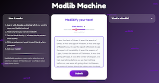
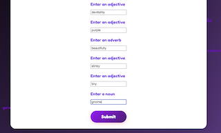
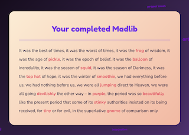

# Madlib Machine — Frontend

A TypeScript/React app that turns any text into a madlib. Paste text, set a blank density, fill in replacement words, and wackiness ensues.

- Live app: https://madlib-frontend-deploy.vercel.app/
- Backend repo: https://github.com/adam-lev-barnett/MadlibMachine-web
- Original CLI version: https://github.com/adam-lev-barnett/madlib-machine

---

## Screenshots

**1. Enter your text and blank density**


**2. Fill in a replacement word for each blank**


**3. Get your completed madlib**


---

## Tech Stack

**Frontend**: React 19, TypeScript, Vite, CSS
**Backend**: Java, Spring Boot, Spring Security, Maven, Stanford CoreNLP, PostgreSQL, Mockito, JUnit

---

## Running Locally

Requires Node.js 18+ and the Spring Boot backend running on port 8080.

```bash
npm install
npm run dev       # http://localhost:5173
npm run build     # type-check + production build
npm run lint
```

The Vite dev proxy forwards `/api`, `/oauth2`, and `/login` to `localhost:8080`.

---

## Architecture

The app is a three-phase flow orchestrated by `LandingPage` via the `useMadlib` hook:

1. **SUBMIT_SOURCE** — user pastes text and sets a skipper (blank density 1–9). Calls `POST /madlibs/madlibify`.
2. **REPLACE_WORDS** — one input per blank, labeled by part of speech. Calls `POST /madlibs/fillMadlib`.
3. **COMPLETE** — the finished madlib is rendered client-side with a staggered word-reveal animation.

All state lives in the hook; child components are purely presentational.

### Authentication

Google OAuth via the backend. After login, a JWT is saved to `localStorage`. A custom `'authChange'` window event notifies `NavBar` to update without a global state library — needed because the native `'storage'` event only fires in other tabs.

---

## Environment Variables

| Variable | Dev | Production |
|---|---|---|
| `VITE_API_BASE_URL` | `/api` (proxied) | backend URL |
| `VITE_BACKEND_URL` | *(empty)* | backend URL |

---

**License**: Educational and portfolio use only.
